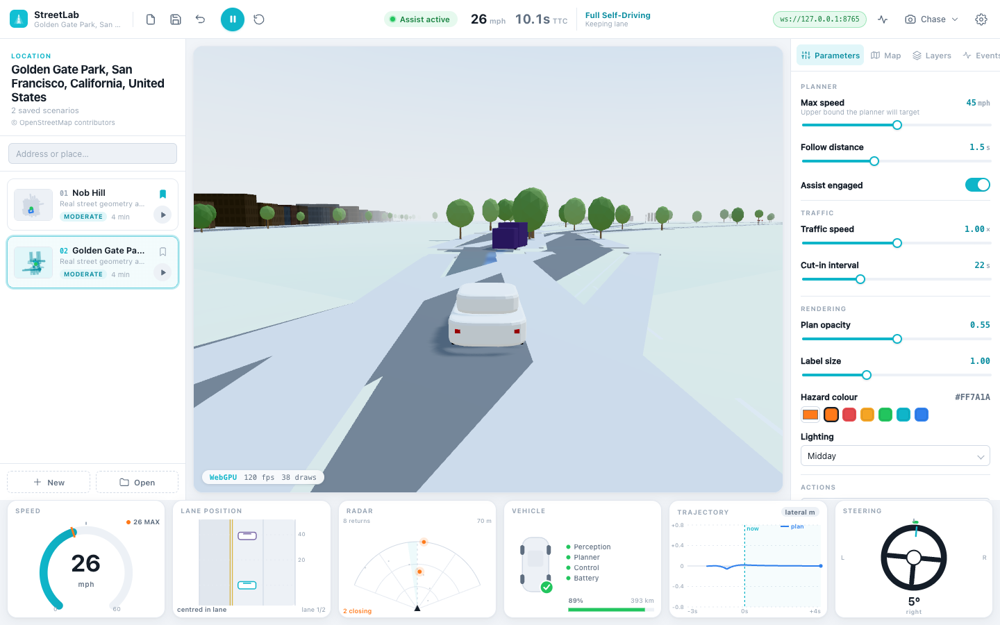
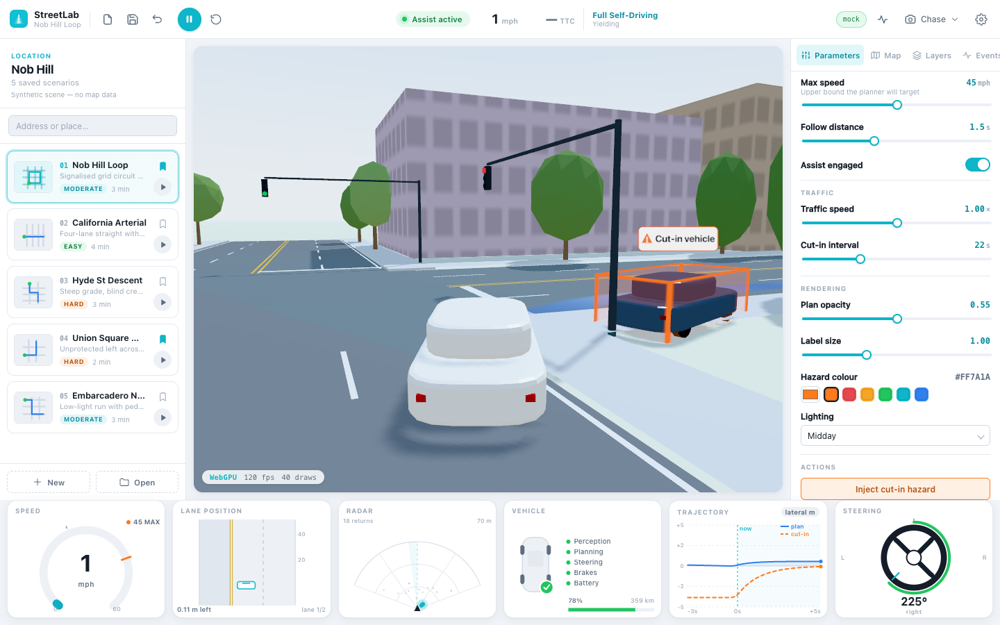
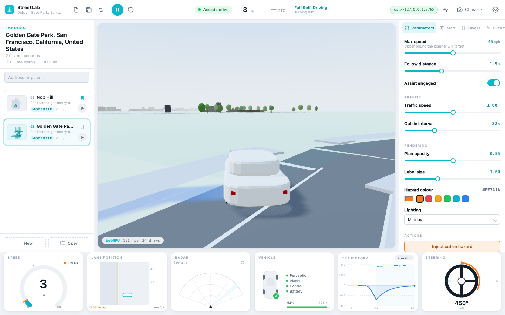
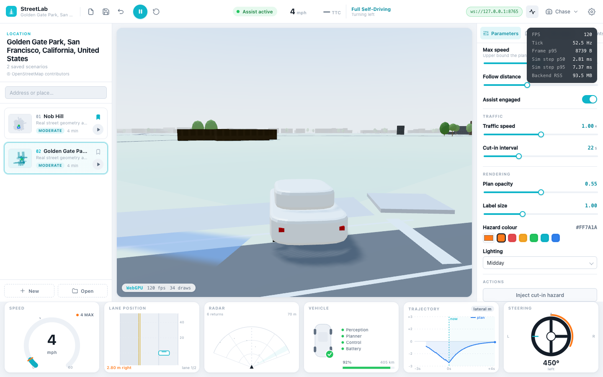

# StreetLab

A simulation and portfolio project — an FSD-style driving-simulator desktop
app. **Not a real-world safety or self-driving system**, and none of the
numbers here are safety claims.

[](LICENSE)
[]()
[](#roadmap)
[](#testing)
[](#testing)



Two packages, developed and tested independently, now wired together:

- **`streetlab/`** — Tauri 2 + React/TypeScript UI and a Three.js WebGPU
  viewport, driven entirely by a message stream. 203 vitest unit tests + 12
  Playwright E2E tests.
- **`streetlab-backend/`** — the Python simulator: a deterministic kinematic
  world, reactive IDM/MOBIL traffic, a real RT-DETR ONNX detector (measured:
  zero vehicle detections — see [Status](#status)) alongside ground-truth
  perception, and a behaviour FSM over a centerline tracker, served over
  WebSocket. 853 pytest tests.
- **`contract/`** — the wire contract shared by both: fixtures generated from
  the real simulation, validated by the real `schema.ts` (zod) and the real
  `schema.py` (pydantic) on every change.

See [`DEMO.md`](DEMO.md) for a full walkthrough, or [Quick look](#quick-look)
below for the short version.

## Quick look

<table>
<tr>
<td width="50%">

**Injected hazard, tracked and predicted**

The planner flags the merging vehicle, draws its predicted path, and the
trajectory graph plots the curve in real time.

</td>
<td width="50%">

**Any address, live**

Type a place name, press Enter — a real Nominatim geocode and Overpass fetch
build and drive it, cached offline after the first load.

</td>
</tr>
<tr>
<td width="50%">

**Live performance overlay**

Every number is read from the running processes — the render loop and the
backend's own `/health` endpoint — not fixture data.

</td>
<td width="50%">

**What's under the hood**

- Tauri 2 desktop shell, zero-config native `.app`
- Three.js + WebGPU (WebGL2 fallback) viewport
- Deterministic Python sim, WebSocket-streamed
- Real OSM street/building geometry via Overpass
- Six live telemetry widgets, schema-validated wire contract

</td>
</tr>
</table>

## Status

Cycles 1–4 are built. Cycle 1 gave the synthetic grid, ground-truth
perception and a centerline tracker; Cycle 2 added real OSM scenes and
in-app address entry; Cycle 3 added junction compliance (the ego stops for
red lights and stop signs), lane-level overtaking, traffic that reacts to
the ego instead of driving through it (IDM car-following, MOBIL lane
changes), and five distinct `inject_hazard` scenarios. Cycle 4 built a real
RT-DETR ONNX detector end to end — camera-frame transport, ONNX inference,
2D-to-world tracking, scoring against exact ground truth, and a toolbar
toggle that hands driving to it — and measured what it found: **zero vehicle
detections** scored against ground truth on the frames tested. COCO-pretrained
weights do not transfer to this renderer's geometry, a domain gap the design
anticipated and named as Cycle 5's motivation. ML perception ships and is
switchable, but it cannot drive the car today; ground-truth perception
remains the default, and the ML toolbar mode stays labelled experimental.
See the [performance table](#performance) below for the full measurement and
[`DEMO.md`](DEMO.md) for the walkthrough. Nothing here is trained on
anything yet (Cycle 5). The
[design doc](docs/superpowers/specs/2026-08-12-streetlab-backend-design.md)
covers the full cycle breakdown; the short version is in
[Roadmap](#roadmap) below.

**Cycle 5 Phase 1 found that Cycle 4 measured that result on mis-encoded
frames.** The detector camera never applied tone-mapping or sRGB output
encoding — a three.js output-render-target bug — so every detector frame this
project produced before the fix was raw linear bytes with a black bottom
band. The bug is fixed, and on correctly encoded frames the detector *still*
detects zero vehicles at any production threshold — so the **zero-detections
finding** above survives; it simply was not honestly earned until now. What
Phase 1 does **not** confirm is the *domain gap* half of that paragraph: it
could not separate "COCO weights don't transfer to these shapes" from "the
targets are 10–44 px" or from a preprocessing defect, and it says so.
Phase 1's two cheap levers (score threshold, renderer encoding) both failed
and the branch decision is fine-tuning, with one cheap candidate still
untested — see
[`docs/measurements/2026-08-22-cycle5-phase1-diagnosis.md`](docs/measurements/2026-08-22-cycle5-phase1-diagnosis.md).

**What's real today:** `StreetLab.app` is a real, double-clickable native
macOS app — launch it and it spawns its own Python sidecar, connects to it,
and renders a live scene with zero configuration. Quitting the app (or
force-quitting it) leaves no orphaned process behind. For development, the
frontend and backend also run as two plain processes talking over a real,
schema-validated WebSocket — see [`DEMO.md`](DEMO.md) for both paths.
The app renders real OpenStreetMap geometry — actual street layouts and
building footprints, not the synthetic grid — into the same unmodified
frontend, with `© OpenStreetMap contributors` attribution carried through to
the scene. The packaged `.app` does this out of the box (it passes
`--source osm` to its own sidecar, and its opening scene is served from an
extract bundled inside the app, so it needs no network); running the backend
by hand, `streetlab serve --source osm` is the same thing. The sidebar's
**Load a location** box then takes any address or place name: press Enter to
geocode it, fetch its real street/building data, and drive it — no restart
required. The build happens off the sim thread, so the car keeps
driving the previous scene the whole time; the box shows a "Building…"
state until the new scene lands (or a `location_failed` event appears in
the Events tab, for an address that fails to resolve or has no drivable
roads). The first load of a brand-new address needs network; the one
bundled location (Nob Hill) and anything already loaded once are cached and
work fully offline.

## Architecture

```
┌─────────────────────────┐   ws://…    ┌──────────────────────────┐
│  streetlab/ (frontend)   │◀───────────▶│  streetlab-backend/      │
│  Tauri + React + Three   │             │  (Python, uv-managed)    │
│                          │  GET /health │                          │
│  wsClient.ts ──────────────────────────▶  server/ws_server.py     │
│  (or the in-process       │            │  server/cli.py            │
│   mock, for offline dev)  │            │  sim/{loop,agents,route}  │
└─────────────────────────┘             │  map/scene_build.py       │
                                          │  perception/service.py   │
                                          │  plan/control.py         │
                                          └──────────────────────────┘
```

Both sides validate every message against the same contract
(`contract/fixtures/`, `contract/validate_py_test.py`,
`contract/validate_ts.test.ts`) — a deliberate field rename, dropped key, or
type change fails both suites, not just one.

### Performance

Numbers below are what the toolbar's performance overlay (toggle it from the
top toolbar) actually reports, live, against a real `streetlab serve`
process — not fixed targets. Sim step time and RSS come from the backend's
`/health` endpoint, polled at 1 Hz.

| Metric | Source | Status |
|---|---|---|
| Render FPS | Frontend render loop | Live in the overlay (typically 30–60) |
| Observed tick Hz | `StateUpdate` inter-arrival | Live in the overlay (~60 Hz) |
| WS frame bytes (p95) | Wire size at receipt | Live in the overlay |
| Sim step p50/p95 | Backend `/health` | Live in the overlay (~1 ms / ~2 ms on an M-series Mac) |
| Sidecar binary size | `scripts/build_app.sh` | **48 MB** (measured, `aarch64-apple-darwin`; includes onnxruntime + Pillow, shapely and the bundled extract) |
| `.app` bundle size | `scripts/build_app.sh` | **52 MB** (measured, includes the sidecar) |
| Cold start (process start → `STREETLAB_READY`) | Task 8's cold-start benchmark, 3 runs each side, same machine and session | **2.415 s** median bundled with onnxruntime (2.481, 2.415, 2.299) vs **2.118 s** median without it (2.412, 2.118, 2.117) — the unbundled side is a throwaway `--exclude-module onnxruntime` comparison build, not part of the shipped artifact. ~0.3 s delta; judged not material, so `--onefile` is kept |
| Backend RSS | Backend `/health` | **~59 MB** synthetic / **~94 MB** on a real OSM scene, measured at startup; live in the overlay |
| Frontend RSS | `ps` on the running `.app` | **~58–72 MB** measured at startup |
| Detector model inference (isolated) | `docs/measurements/2026-08-20-detector-comparison.md` | **58.9 ms** median, v1 **int8** on `CPUExecutionProvider` (fp32 of the same architecture measured a probable 1.3–1.5× of this, on n=1-per-cell data — Cycle 5 Phase 2, Section 6) (per-frame 64.7, 59.1, 58.5, 58.7, 58.7, 58.9, 58.9, 58.9 ms) — `session.run()` only, on byte-identical preprocessed tensors; excludes JPEG decode and resize |
| Detection quality | `docs/measurements/2026-08-20-detector-comparison.md` | **0 / 8** frames scored a vehicle detection above the 0.50 threshold — v1 and v2 tied. Both models are confident about *something* in every frame, and on these frames never a vehicle: low-poly trees read as umbrellas and vases, buildings as TV monitors. **The "never a vehicle" half is a property of the *stretch* preprocessing the app ships, not of the detector**: under letterboxed preprocessing, Cycle 5 Phase 2 found `car` to be the single top-scoring class of all 80 on **6 of 60** benchmark frames at int8 and **5 of 60** at fp32, against **0 of 60** under stretch at either precision — still nowhere near the 0.50 threshold, and in a score field letterboxing also lowers. v2 detects stop signs (a real StreetLab class) in 4 of 8 frames at up to 0.645 — a diagnosis worth noting, not a benchmark: 8 frames, one synthetic scene. **Both figures are properties of the int8-quantized checkpoints measured, not of "the detector"**: Cycle 5 Phase 2 later found fp32 weights of the same architecture more than double the peak car score on a 60-frame benchmark. The 0-detections result itself survives that swap — all four cells of the factorial score zero true positives at the 0.50 threshold — see [`docs/measurements/2026-08-26-cycle5-phase2-gates.md`](docs/measurements/2026-08-26-cycle5-phase2-gates.md) |
| Closed-loop server round trip | `PerceptionStats.detector_ms` / `server_e2e_ms` — measured for this README, through the real `PerceptionPipeline` + cached v1 weights, driven on a **synthetic** frame (throwaway script, not committed; unlike the comparison doc above, whose 8 frames were real intercepted `camera_frame` JPEGs) | **~71 ms** median (per-frame 80.7, 68.2, 68.0, 69.2, 70.6, 72.6, 71.5, 70.9 ms; excludes a one-time ~410 ms first-frame session build). This is what the wire and the perception panel actually report — JPEG decode + resize + inference + postprocess, socket-arrival-to-detections-available. It still excludes render, GPU readback, JPEG *encode* and the websocket transfer, so true glass-to-decision latency runs higher |
| Detector disk cost | `du -h` on the sidecar and the cached weights file | **onnxruntime + Pillow bundled in the sidecar** (part of the 48 MB above, not separately broken out); **weights fetched at runtime**, not bundled — the cached `.onnx` file is **21 MB** (`~/Library/Caches/StreetLab/models/`) |
| Map cache budget | `map/cache.py` | 99 MB LRU ceiling; one Nob Hill extract is **3.2 MB** |

**Detection quality is scored** by greedy class-gated matching at a 3 m gate,
against exact ground truth as of the frame's timestamp — that excludes
transport latency, which `server_e2e_ms` reports separately, so a slow round
trip cannot read as a bad detector. On that method: **recall is 0.00** —
*derived, not measured.* Every other figure above carries the command that
produced it; this one cannot, because the comparison doc is an offline run
over 8 intercepted JPEGs that never calls `score()`, `PoseHistory` or a
`Simulation` at all. It follows from zero predicted boxes: nothing can match,
so every truth object in range is a false negative and the ratio is 0/N —
conditional on there being truth in range, since with none `score()` returns
`recall=None`, not `0.0`. **Precision and mean position
error are undefined** (0/0: with no predicted boxes at all, neither ratio has
a denominator), which the panel renders as `—`, never a fabricated `0.0` — an
undefined metric is not a softer claim than a zero one. No run of the shipped
detector (or the alternative exported and measured alongside it) produced a
single scored vehicle detection. That is not "promising" and it is not "a
foundation" — read plainly, **ML perception cannot drive the car today.** The
closed-loop round trip above describes how stale a detection would be if the
pipeline produced one; at zero detections that number has nothing to attach
to, so the toolbar's ML mode keeps its **experimental** label, now because of
a measured absence of signal rather than an unmeasured guess about
staleness.

GPU/ANE utilisation isn't reported: the detector runs on
`CPUExecutionProvider`, not CoreML, so there is no ANE/GPU inference for the
OS to attribute. CPU was chosen because it measured **4× faster than CoreML**
on this model (63 ms vs 270 ms, int8, a separate Phase 2 five-run session —
not the 58.9 ms Task 7 comparison-doc figure earlier in this table, a
different measurement of the same model and provider) — see
`docs/superpowers/specs/2026-08-19-streetlab-cycle4-design.md`'s amended
definition-of-done item 4. Measured figures are one run on an Apple Silicon
Mac, not a benchmark suite — treat them as a ballpark, not a guarantee.

## Running it

See [`DEMO.md`](DEMO.md).

## Testing

```bash
cd streetlab-backend && uv run pytest -q         # 910 passing (906 + 4 contract), 1 skipped
cd streetlab && npx vitest run                    # 205 tests, includes ../contract
cd streetlab && npm run test:e2e                  # 12 Playwright specs
```

## Roadmap

Deliberately split into cycles; Cycles 1–4 are built. Each later cycle drops
in behind an existing seam (`SceneSource`, `PerceptionSource`, `Planner`,
`TrafficModel`) without touching the cycles before it.

| Cycle | Adds | Status |
|---|---|---|
| 1 | Synthetic grid, scripted traffic, ground-truth perception, centerline planner, real-time WS server, native sidecar integration | **Built** |
| 2 | Real map data via OSM ingest (`OsmSceneSource`), address/route commands | **Built** — OSM ingest behind the SceneSource seam (Phase 1), plus in-app address entry, an off-thread build executor, and offline bundled extracts (Phase 2) |
| 3 | Junction compliance (red lights, stop signs), lane-level overtaking, reactive traffic (IDM/MOBIL) and the full hazard scenario set | **Built** — signals and stop signs behind a behaviour FSM (Phase 1), carriageway-checked lane changes with a labelled return (Phase 2), and IDM car-following, MOBIL lane changes and five distinct hazards (Phase 3) |
| 4 | ML perception (a real ONNX detector) alongside ground truth | **Built** — camera-frame transport off the render thread (Phase 1); a real RT-DETR ONNX detector whose 2D boxes become tracked world-frame detections (Phase 2); scoring against exact ground truth, a toolbar toggle to drive on ML detections, and shadow-mode box overlays (Phase 3). Measured result: **zero vehicle detections** on the frames tested — see [Performance](#performance) — so ground truth stays the default and ML mode stays labelled experimental. (Cycle 5 Phase 1 later found those frames were mis-encoded by a renderer bug; the result reproduces on correctly encoded frames — see [the Phase 1 diagnosis](docs/measurements/2026-08-22-cycle5-phase1-diagnosis.md). Cycle 5 Phase 2 then found that every score behind it was measured on **int8-quantized** weights that had never been compared against the unquantized checkpoint: fp32 more than doubles the peak car score, though the zero-detections result at the production threshold survives that too — see [the Phase 2 factorial](docs/measurements/2026-08-26-cycle5-phase2-gates.md).) |
| 5 | Sim-generated training dataset, fine-tuning, evaluation | **In progress** — Phase 1 (diagnosis) measured two cheap levers against a committed 60-frame benchmark and **both failed**: score threshold (peak vehicle-class scores never exceed **car 0.1872** anywhere in the set on the shipped int8 weights, and the few true positives at threshold 0.01 are not distinguishable from a sham control) and renderer encoding (a real three.js output-target bug, fixed — every detector frame before it was raw linear bytes with a black bottom band — which transforms the imagery but moves peak car score only **1.089×** against a **1.064×/1.093×** noise floor). Per-class decoding was ruled out too. **Branch decision: the levers measured do not reach this gap, so fine-tuning is warranted** — though Phase 1 could not separate "the model doesn't know these shapes" from "the targets are 10–44 px at 31.5–88.5 m", and it left one cheap candidate untested (the preprocessing path stretches every 640×384 frame to 640×640 with no letterboxing, distorting exactly those small targets). Both are recorded as Phase 2's first experiments. See [`docs/measurements/2026-08-22-cycle5-phase1-diagnosis.md`](docs/measurements/2026-08-22-cycle5-phase1-diagnosis.md). **Phase 2 measured those two candidates as a 2×2 factorial** — aspect handling (stretch vs letterbox) × weight precision (the shipped int8 checkpoint vs fp32 of the same architecture) — against the same frozen 60-frame benchmark, with run-to-run jitter measured first and found to be **exactly zero**, so every delta below is real. Peak car score: **0.1872** shipped, **0.2778** letterbox alone, **0.3917** both, **0.4880** fp32 alone — a **2.61×** lift from the precision swap, the largest effect either cycle has measured, and larger than the combined cell. **Read that lift with its caveat:** the peak sits on a single frame (`000057.jpg`) against a median per-frame gain of only **+0.0114**, a factor of 26, so it is a ceiling that moved rather than a whole set that did. All three cells clear the pre-committed decision rule, but only fp32 is supported by anything beyond the peak: it is the one cell whose true positives beat a sham control at every threshold it detects at (on margins as thin as one detection), and its false positives *fall* 475→136 at threshold 0.10. Letterbox alone raises the peak while losing the baseline's only margin over chance, so it is **not a detection lever on this evidence** — with one finding pointing the other way that the phase records rather than resolves: letterboxing is the only configuration tested, at either precision, that makes `car` the top-scoring class of all 80 on any frame (6/60 and 5/60, against 0/60 for both stretch cells including the ranked winner) — the first vehicle-argmax frames either cycle has produced, on 11 frame-cells of 240. **Nothing is shipped:** every cell still scores **zero** true positives at the production threshold 0.50, fp32 costs a probable 1.3–1.5× per-frame latency that — unlike the scores — was never floor-cleared, and changing the packaged app's default model is its own decision with its own evidence. **Branch decision: fine-tuning is not overturned, but its evidentiary basis is now known to be checkpoint-specific** — two cycles of "the detector sees nothing" were measured on quantized weights nobody had compared against, and quantization was not named as a candidate anywhere until Phase 1's final review. Phase 3 is planned against that record, not by it. See [`docs/measurements/2026-08-26-cycle5-phase2-gates.md`](docs/measurements/2026-08-26-cycle5-phase2-gates.md). **A follow-up settled the largest open question about that lift.** Phase 2 could not tell whether fp32 helps *vehicles* or simply recalibrates the whole 80-class label space, and published the second reading as live. Dumping every class's score for both checkpoints refutes it: **70 of 80 classes *fall* under fp32 and the median class moves −0.0110**, where a broad recalibration predicts the label space rises. Car clears a top-decile test pre-committed before the dump existed, under all three comparison sets (rank 4/80, 4/74, 2/23), and leads every class on peak ratio. It is **not** a vehicle effect either: `stop sign` rises 26× more than car on median delta, and the other two risers above car are `parking meter` and `fire hydrant`. The effect is selective, car is among the selected, and the ranking metric does not move — only what the winner means does. See [`docs/measurements/2026-08-27-cycle5-fp32-class-specificity.md`](docs/measurements/2026-08-27-cycle5-fp32-class-specificity.md). |

## Licenses

The repository's position: no AGPL/GPL or non-commercial-trained weights in
the packaged `.app`; research-only datasets are benchmarking-figure sources,
never training inputs.

The detector that ships is RT-DETR v1 (`onnx-community/rtdetr_r18vd`,
**Apache-2.0**, int8-quantized), pretrained on **COCO** (Common Objects in
Context) — used here only as pretrained weights and a benchmarking-figure
source, never redistributed and never a training input. Its weights are
**fetched at runtime into a content-addressed cache**
(`~/Library/Caches/StreetLab/models/`, verified by sha256 on every load),
not bundled in the repo or the packaged `.app`; the sidecar bundles the
`onnxruntime` runtime that runs them, not the weights themselves. No repo
file or shipped `.app` contains model weights.

`scripts/export_detector.py` also exports RT-DETRv2
(`PekingU/rtdetr_v2_r18vd`, also Apache-2.0, also COCO-pretrained). It was
exported and measured against v1 on 2026-08-20
(`docs/measurements/2026-08-20-detector-comparison.md`) and did **not**
replace it: both scored zero vehicle detections on the frames tested, and
v1 is faster and 3.7× smaller. The script remains a dev-only tool (needs
`torch` + `transformers`, neither a project dependency) run by hand, not
part of any build or test step.
