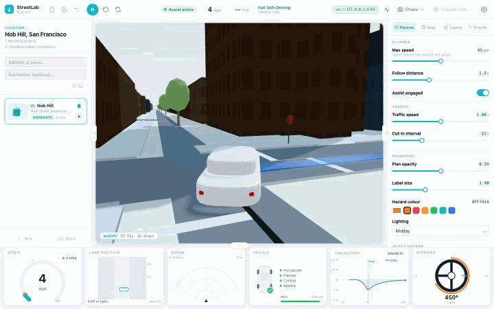
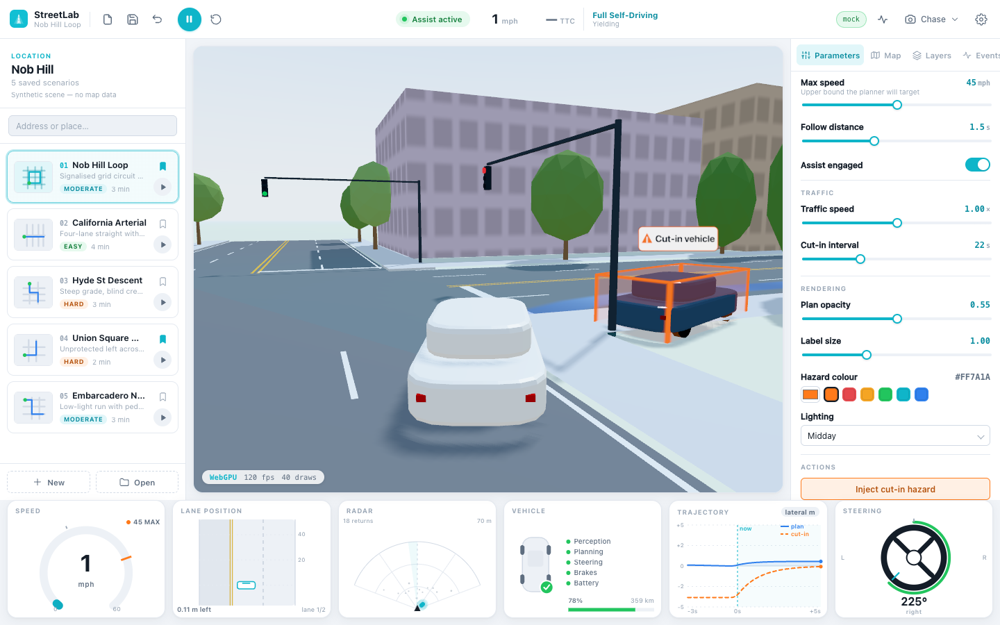
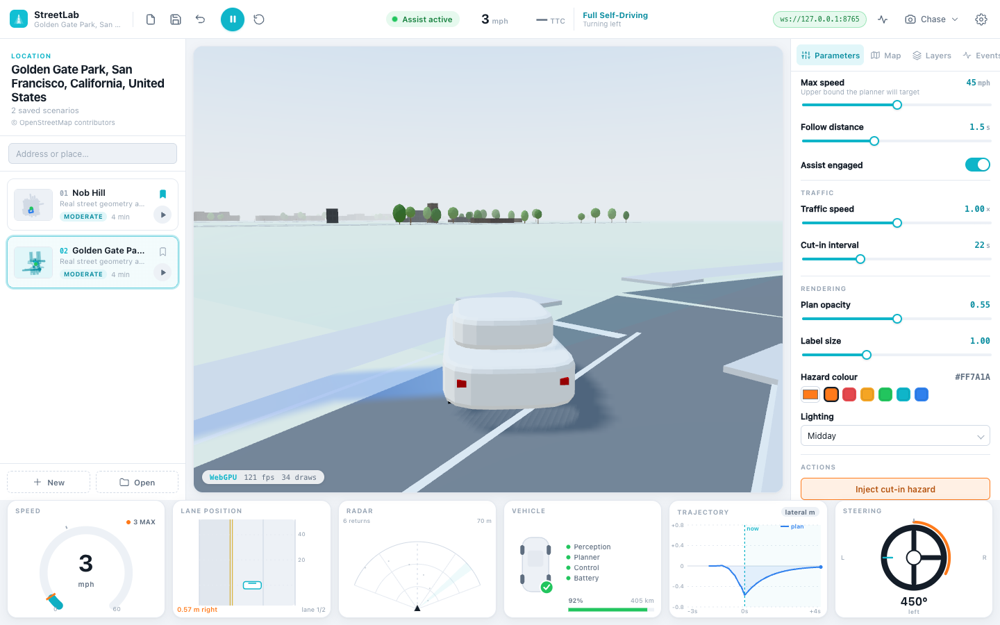
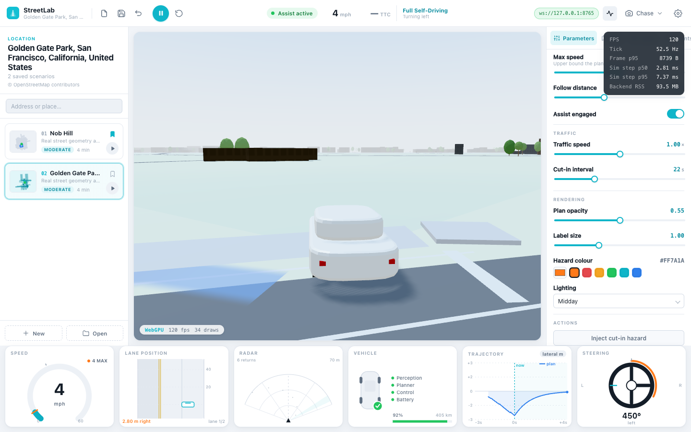

# StreetLab

A self-driving simulator I built solo: a native macOS app that drives a car
through real OpenStreetMap streets, with a from-scratch physics sim, a
reactive traffic model, and a real computer-vision detector running in the
loop. **A portfolio/learning project, not a production AV system** — nothing
here is a safety claim.

[](https://github.com/jasonpereira518/streetlab/actions/workflows/ci.yml)
[](LICENSE)
[]()
[](docs/ARCHITECTURE.md#roadmap)



## What's real, what's simulated

| Real | Simulated |
|---|---|
| Street and building geometry from OpenStreetMap; any address geocoded live | The car (kinematic model) and all other traffic (IDM car-following, MOBIL lane-changing) |
| An RT-DETR ONNX object detector running inference on the simulator's camera frames | The camera imagery itself: a low-poly Three.js render, not photographs |
| Telemetry (FPS, tick rate, sim latency, memory) read from the running processes | Hazards such as cut-ins are scripted injections |
| One schema validating every WebSocket message on both the TypeScript and Python sides | |

## Quickstart

macOS on Apple Silicon. You need Rust, Node ≥ 20 and [`uv`](https://docs.astral.sh/uv/); `uv` fetches Python 3.11.

```bash
git clone https://github.com/jasonpereira518/streetlab.git && cd streetlab
bash scripts/build_app.sh
open streetlab/src-tauri/target/release/bundle/macos/StreetLab.app
```

It opens on Nob Hill from a bundled extract, no network needed; type any
address to load it live. Dev setups and a walkthrough are in [`DEMO.md`](DEMO.md).

<table>
<tr>
<td width="33%"><br>An injected hazard, tracked and predicted</td>
<td width="33%"><br>Any address, loaded live</td>
<td width="33%"><br>Live performance overlay</td>
</tr>
</table>

## Highlights

- **Real-time 3D rendering**: Three.js over WebGPU, with a WebGL2 fallback.
- **Native desktop app**: a Rust/Tauri shell that runs the Python simulator as a sidecar; a zero-config `.app`.
- **Deterministic simulation**: kinematic vehicle model, IDM car-following, MOBIL lane-changing and a signal/stop-sign FSM on a fixed-step loop.
- **Real-world maps**: live geocoding and OpenStreetMap ingest, cached for offline use and built off the render thread so the car never stutters while a block loads.
- **ML inference in the loop**: camera frames → RT-DETR (ONNX) → 2D-to-3D tracking → scoring against ground truth.
- **Schema-enforced contract**: fixtures generated from the real simulation are validated by the zod and pydantic schemas.
- **1,400+ automated tests**: 1,198 backend (pytest), 276 frontend (vitest), 21 end-to-end (Playwright); counts as of 2026-10-04.

## Results

I built the whole loop for putting a real detector inside a simulator and
measuring it honestly: sim-captured frames, exact ground-truth labels, a
training and evaluation pipeline, quantization and latency benchmarks.
Treating every claim as something to measure rather than assume is what
turned up these findings:

- **A measurement bug, caught before it could mislead.** The detector's camera path was missing tone-mapping/sRGB encoding (a Three.js render-target bug), so every early detector frame was raw linear data. I fixed it and re-ran the comparison before trusting any number.
- **Quantization, measured.** int8 vs fp32 of the same model: fp32 lifts peak detection confidence about **2.6×**, and CPU inference measured **4× faster than CoreML** for this model, which is why the sidecar runs on `CPUExecutionProvider`.
- **Domain gap, quantified.** On this renderer's low-poly imagery the pretrained detector finds **zero vehicles** at the production threshold, even after the fix and in fp32. Ground truth therefore drives the car and the detector runs in shadow mode, labelled experimental.
- **A null result, reported as one.** The capture → label → train → export → evaluate pipeline ran on 12 captures (3,430 labeled boxes). The fine-tuned checkpoint scored *below* the pretrained baseline on held-out data, so it is not shipped.

Methodology, thresholds and what was walked back after review are in
[`docs/measurements/`](docs/measurements/); the scripts that produced them are in
[`scripts/`](scripts/).

## Testing

```bash
cd streetlab-backend && uv run pytest -q tests ../contract   # 1198 passed, 1 skipped (~9 min)
cd streetlab && npx vitest run                    # 276 tests in 17 files, includes ../contract
cd streetlab && npm run test:e2e                  # 21 Playwright tests in 5 specs
```

CI runs typecheck, vitest, pytest and the contract tests on every push ([Actions](https://github.com/jasonpereira518/streetlab/actions)). Playwright runs there as an advisory job: on GPU-less hosted runners a few canvas-screenshot specs time out ([measurements](docs/measurements/2026-10-04-e2e-flake-rate.md)), and the suite passes on a developer machine. Counts measured 2026-10-04.

## More

[`docs/ARCHITECTURE.md`](docs/ARCHITECTURE.md) has the tech stack, component diagram, per-cycle roadmap and licensing. Design specs and implementation plans are in [`docs/superpowers/`](docs/superpowers/). MIT licensed; the detector weights (RT-DETR v1, Apache-2.0) are fetched at runtime and never bundled.
